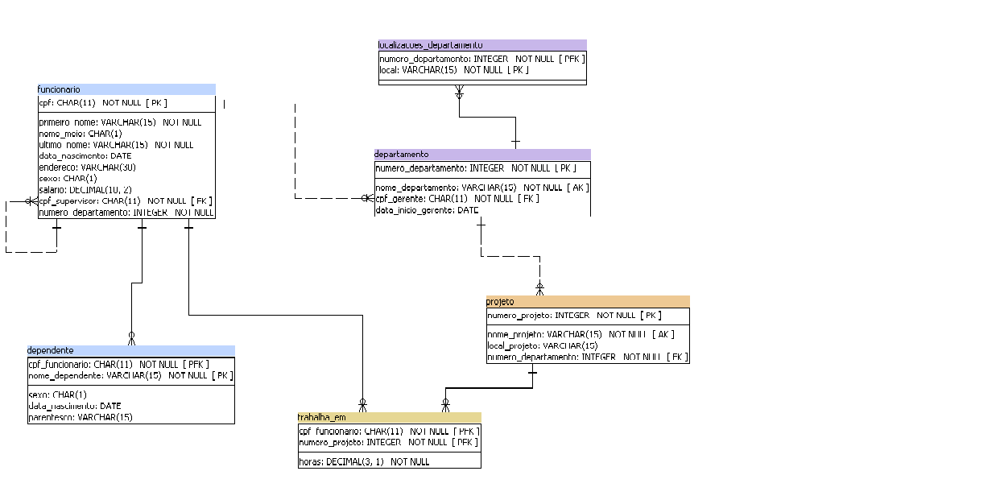

# ESQUEMA DO BANCO DE DADOS
Dentro dessa pasta vou falar um pouco sobre o trabalho feito no programa Power Architect, onde funcionou como facilitador para a criação das tabelas dentro do Banco de Dados.

## Tabela Elmasri

* A tabela acima foi criada dentro do Power Architect baseado na tabela de exemplo dado no arquivo do pset. Essa tabela tem todas as tabelas necessárias para criar o banco de dados. 
* Após criar a tabela no power architect é necessário criar o código para implementar dentro do seu banco de dados. 
* A seguir tem o exemplo da criação do código para *MYSQL* dentro do power architect:

Após criar o código no Power Architect, o resto deverá ser feito dentro do banco de dados usando cada linguagem. Para saber mais sobre o script clique aqui para ir direto para a [pasta scripts](https://github.com/danielguasti/uvv_bd_1_cc1m/tree/main/Scripts).
